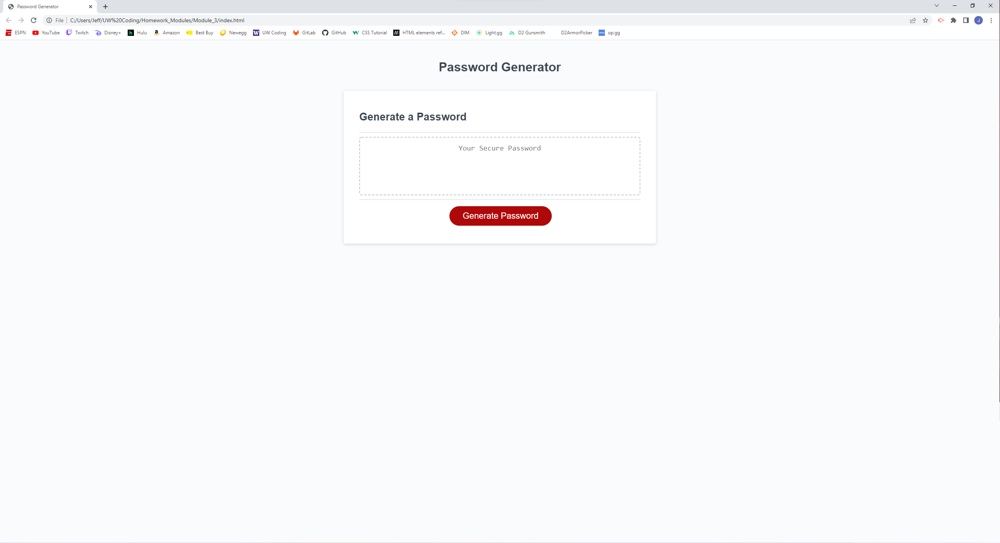

# Password-Generator

This repository contains starter code that has been refracted to meet the given Acceptance criteria.

In the first commit, the original code is cloned into the repo.

In the second commit, the script.js is adjusted to meet the Acceptance criteria.

In the third commit, the script.js is cleaned up with changes made to reflect user input.

In the fourth commit, a screenshot of the application is added.

Here is the web application's appearance and functionality:

This is the link to the deployed application:
https://codejeffk.github.io/Password-Generator/
